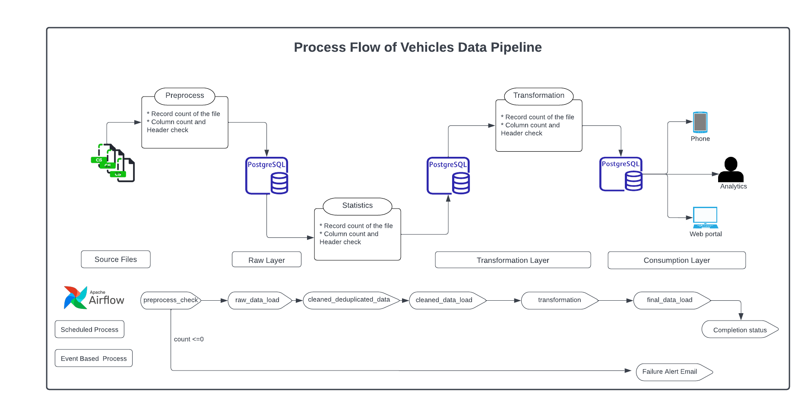

**LTV Vehicles Data pipeline**

**Requirements**

**​​Getting Started**

### Prerequisites

1.  [Install Node 14](https://nodejs.org/en/download/); Homebrew
    > installed? brew install node\@14

    -   Install gulp-cli npm i -g gulp-cli

2.  [Install Go](https://golang.org/doc/install); Homebrew installed?
    > brew install golang

    -   Install claat go install
        > github.com/googlecodelabs/tools/claat\@latest

    -   Ensure go and claat is in your PATH [claat path
        > setup](https://github.com/Snowflake-Labs/sfquickstarts#claat-related-errors)

3.  Optional: install the live-reload plugin for Chrome:
    > [LiveReload](https://chrome.google.com/webstore/detail/livereload/jnihajbhpnppcggbcgedagnkighmdlei)

### Run locally

1.  Fork this repository to your personal github account (top right of
    > webpage, fork button)

2.  Clone your new fork git clone
    > git\@github.com:\<YOUR-USERNAME\>/sfquickstarts.git sfquickstarts

3.  Navigate to the site directory cd sfquickstarts/site

4.  Install node dependencies npm install

5.  Run the site npm run serve

Congratulations! You now have the Snowflake Quickstarts landing page
running.

**Process Flow Diagram**

{width="7.631419510061242in"
height="3.8097386264216975in"}

**Steps of the Process**

1)  **Source files:**

> Type of data : csv
>
> Number of columns : 21
>
> Expected arrival :\<arrival time\>
>
> File location :/opt/airflow/dags/data/vehicle_challenge.csv

2)  **Preprocess:**

> Code location :dags/data_pipeline_dag.py
>
> Airflow Task :source_data_check
>
> Checks Completed :

-   Check total number of records : If count is equal to zero abort the
    > process and Send Email alert with Zero record message.

-   Column count to check the Layout of the data :If columns of the data
    > file are less or more than expected, Send Email alert.

3)  **Raw Layer:**

> Postgres Database :airflow
>
> Postgres Schema :public

Audit Columns :insert_date

Code location :dags/sql/create_table_sql_query.sql

Airflow Task :create_table

Create source Table :vehicles_information (21 columns)

> Create statistics Table :vehicle_statistics
>
> Create cleaned Table :vehicles_deduped_information
>
> Create Seller info Table :vehicles_seller_information
>
> Create final Table :vehicles_transformed_information

4)  **Insert Raw data into Postgres Table:**

> Code location :dags/data_pipeline_dag.py
>
> Airflow Task :pg_extract_task

5)  **Check data and build statistics:**

> Postgres Database :airflow
>
> Postgres Schema :public

Postgres statistics Table : vehicle_statistics ( 2 columns)

Audit Column : insert_date

Code location :dags/sql/check_data_sql_query.sql

Airflow Task :check_data

Checks completed : Count the total number of records loaded

> Count the unique VINs in the data
>
> Count how many records have VIN and price
>
> Records Lost during cast conversion
>
> Top 10 of cities with the most F-150 pick-up trucks registered

6)  **Deduplicate and Cast conversion :**

> Postgres Database :airflow
>
> Postgres Schema :public

Postgres cleaned Table :vehicles_deduped_information

> Code location :dags/sql/deduplicate_data_sql_query.sql
>
> Airflow Task :deduplicate_data
>
> Checks completed : Removes duplicate vehicles, leaving only the record
> with the highest mileage\
> Cast Conversion

7)  **Transformation Layer:**

> Code location :dags/sql/transformation_sql_query.sql
>
> Airflow Task :Transformation
>
> Transformations completed:

-   Mileage_range : provides which range category the Vehicles fall's
    > into.

-   Generic_fuel_type : provides Gas/Hybrid/Electric.. Category of
    > Vehicles information.

-   Vehicle_status : 'semi-new' values are populated based on the
    > mileage.

-   Avg_miles_by_make: provides avg miles by the make and model of the
    > vehicle.

-   Vehicle Seller Table : vehicles_seller_information ( 6 columns)

> Generate an additional seller table with the name, address and amount
> of vehicles listed
>
> for this particular seller. But only for the sellers that list 5 or
> more vehicles.
>
> Split logic location :

8)  **Final Load:**

> Postgres Database :airflow
>
> Postgres Schema :public

Postgres target Table :vehicles_fact , make_dimension,

Audit Columns :insert_date

9)  **Create a VIN decoding map:**

> Create a VIN decoding map. Check Wikipedia to know the adequate VIN
> prefix length and which vehicles to leave out of the map. The map
> should have the VIN prefix, and the make, model, and year. Double
> extra: flag as imports those vehicles which VIN manufacturing process
> are outside of the US and Canada.
>
> **Vin decoding:**
>
> **select**
>
> **substring**(vin,1,3) WMI,
>
> **substring**(vin,4,5) attr,
>
> **substring**(vin,9,1) checksum,
>
> **substring**(vin,10,1) year_vin,
>
> **substring**(vin,12,1) plant_cd,
>
> **substring**(vin,13,5) seq,
>
> \"year\",vin,
>
> **case** **when**
>
> vin **LIKE** **ANY**(**ARRAY**\[
> \'7H%\',\'7I%\',\'7K%\',\'7L%\',\'7M%\',\'7N%\',\'7O%\',\'1%\',\'4%\',\'5%\',\'7SA%\'\])
> **then** \'Y\'
>
> **else**
>
> \'N\' **end** **as** manufactured_in_na,
>
> make,model
>
> **from** vehicles_information vi **where** seller_name = \'east coast
> auto source\' **order** **by** make,model ;

**Entity Relationship Diagram**

**DAG Process Flow**

**SNAPSHOT of Data**
